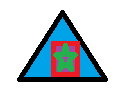

+++
title = "Bullet Hell"
description = ""
date = "2020-08-27T02:18:34-07:00"
draft = true
notoc = true  
tags = ["programming"]

# edit this!!!!
image = ""
custom_js = []
custom_css = []
view_git = ["bullet-hell/js/bullet-hell.js"] 
+++

i decided to rebuild my old shooter, game in the jumble of my life i think i lost the original source code!
<!--more-->
<!-- i need smarter more responsive way to handle the size of the canvas! -->

	
	
	<canvas id="gameBoard" width="1200px" height="800px" style="position: relative; right:100px;" ></canvas>
	

