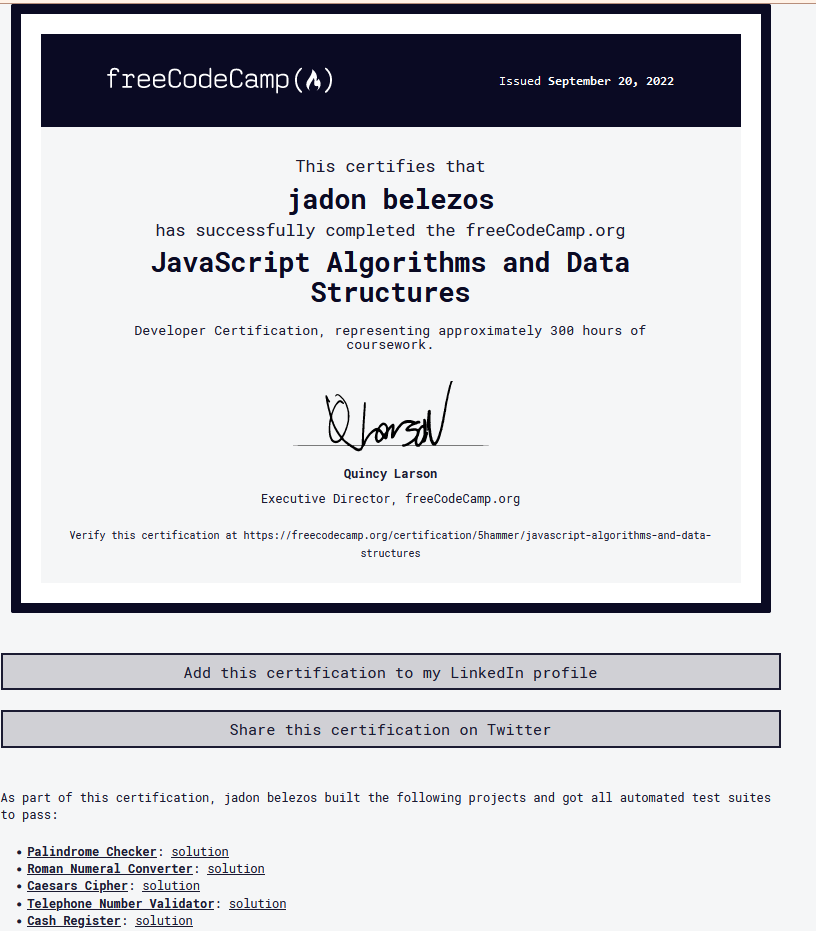

+++
title = "Free Code Certification"
description = ""
date = "2022-09-22T08:30:19-07:00"
draft = false
notoc = true  
tags = ["programming"]
image = ""
custom_js = []
custom_css = []
+++
 
 earlier this week i had completed the javascript datastructures and algorthims certification from  freecodecamp. 

<!--more-->

there are two big things i learned about from it. 

one is i began to understand the object prototypal system in javascript. before this cert when i ever i wrote javascript, i hardly every used an
Object Orient programming style.  i learned how you can use prototype apply to different objects. 

the next big thing is i feel i like i have better understanding of regular expressions. the ability to test for a particular type of string and check it matches a pattern is 
incredibly useful but also from experience if you take it too far it ends up making the code feel more complicated because all of the logic is in the regex and not in the code
itself. 

well here is [my certification](https://www.freecodecamp.org/5hammer). be on the look out for changes to the page to show example applications using the freecode camp certificaton. 

